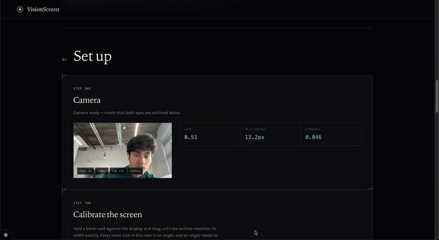
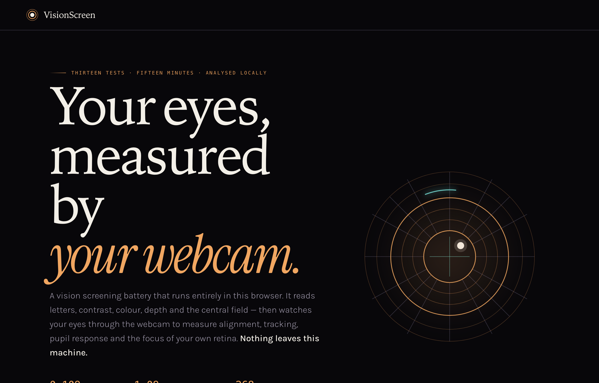
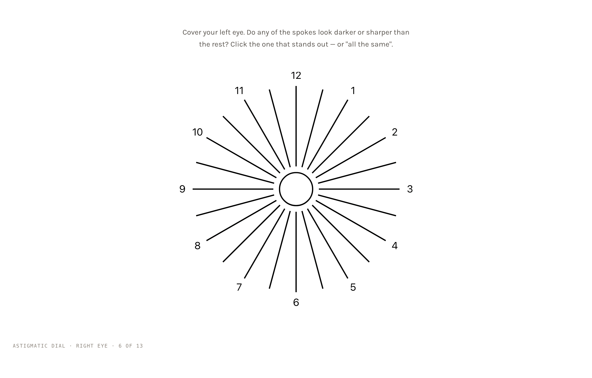

# VisionScreen

A vision screening battery that runs in a browser and reads your eyes through a
webcam. Thirteen guided tests — letters, contrast, colour, depth, the central
field — while the camera watches your eyes for alignment, tracking, lid position
and pupil response, and takes a further set of measurements passively from the
same video. It ends with a plain-language interpretation of what the numbers
might mean, and an explicit account of what they cannot.

<p align="center">
  
</p>

<p align="center"><em>Live tracking: iris centre, lid contour and gaze, at frame rate, in the browser.</em></p>

<table>
<tr>
<td width="50%"></td>
<td width="50%"></td>
</tr>
<tr>
<td><em>Setup — screen calibration, viewing distance, and what the run can and cannot see.</em></td>
<td><em>The astigmatic dial, one of the thirteen guided tests.</em></td>
</tr>
</table>


> **Screening tool, not a diagnosis.** It cannot measure eye pressure, examine
> the retina, or rule out disease, and it has **not been validated against
> clinical measurement in human subjects**. In one study of adults who
> considered themselves healthy (median age 70), about one in three had a
> finding at a full eye exam that a test like this cannot detect. Use it to
> decide whether to book an eye exam — never to skip one.

Possibly the most useful thing about it is how carefully it refuses to
overclaim. See [What it cannot do](#what-it-cannot-do).

---

## Results

Two components are benchmarked against published work, and both beat it. Full
methods, citations and error budget in **[`docs/BENCHMARKS.md`](docs/BENCHMARKS.md)**.

### Periorbital segmentation — beats DeepLabV3-ResNet101 at 0.47% of its size

Visible-light face photographs (Chicago Face Database + CelebAMask-HQ, 2,842
annotated images), against Nahass et al., *Ophthalmology Science* 2025.

| class | ours (Dice) | DeepLabV3-ResNet101 | |
|---|---|---|---|
| iris | **0.940** | 0.93 | +0.010 |
| sclera | **0.846** | 0.81 | +0.036 |
| lid | **0.867** | 0.79 | +0.077 |
| caruncle | **0.755** | 0.65 | +0.105 |

**284,214 parameters** against roughly 60,000,000. Mean Dice 0.877 across five
structures; mIoU 0.788.

Sclera is the number worth noting — it is the hardest class in this literature
(the OpenEDS 2020 baseline manages 0.674 IoU; zero-shot SAM 2 gets 0.074),
because its boundary with the lid is a shadow rather than an edge.

### Anaemia from conjunctival pallor — real clinical labels

CP-AnemiC: 710 conjunctival photographs from ten hospitals in Ghana, each with a
**laboratory haemoglobin value**.

| | |
|---|---|
| AUC (leave-one-hospital-out, nested selection) | **0.855** (95% CI 0.827–0.882) |
| sensitivity at the reference study's specificity | **0.705** vs Collings et al. 2016's **0.57** |
| haemoglobin MAE | 1.56 g/dL |
| worst held-out hospital | AUC 0.790 |

Three choices make that comparison honest: **leave-one-hospital-out** (site
prevalence ranges 48–88%, and each site is a different camera, light and
operator), **nested model selection** (picking a model family by its held-out
score is test-set selection), and a **matched operating point** (comparing at
whatever threshold each side happened to use compares operating points, not
tests).

One expectation was wrong and is recorded as such: a random split was predicted
to inflate the score badly. The gap was **0.001 AUC** — hand-built colour
features do not memorise sites the way learned features do.

---

## Quick start

```bash
git clone https://github.com/aaryanpatil2007/vision-screen.git
cd vision-screen
python3.12 -m venv .venv
.venv/bin/pip install -e ".[dev]"
.venv/bin/python -m playwright install chromium   # browser tests only

.venv/bin/uvicorn webapp.app:app --port 8000
```

Open <http://127.0.0.1:8000>. Everything runs locally; no video leaves the machine.

```bash
.venv/bin/python -m pytest -q          # 429 tests
```

---

## What it measures

| Test | Output |
|---|---|
| Visual acuity — binocular, right, left | logMAR + Snellen, corrected for measured viewing distance |
| Contrast sensitivity | log CS (Pelli-Robson triplets, 2-of-3 rule) |
| Astigmatism | minus-cylinder axis from the clock dial |
| Colour vision | luminance-matched plates, protan/deutan lean |
| Central field | metamorphopsia / scotoma marks (Amsler grid) |
| Depth perception | stereo threshold in arcsec (dynamic random-dot, catch trials) |
| Binocular fusion | fusion / suppression / diplopia (Worth four-dot) |
| Eye movement | smooth-pursuit gain, catch-up saccades |
| Eye alignment | deviation in prism dioptres (Hirschberg) |
| Pupil response | constriction %, anisocoria |
| Refraction | sphere / cylinder / axis posterior (eccentric photorefraction) |
| Eyelid position | margin-reflex distance, ptosis screen |
| Corneal arcus | annulus contrast at the limbus |
| Sclera appearance | yellowness / redness, gated on a white reference |
| Red reflex | between-eye asymmetry (heavily capped — see below) |
| Viewing distance | measured per frame from iris diameter; corrects acuity |
| Viewing behaviour | squinting, lean-in, head tilt |

Thirteen of these are guided steps you actively take; the rest — lid position,
corneal arcus, red reflex, viewing distance and viewing behaviour — are measured
passively from the same video, which is why a report lists more findings than
there were tests.

Two tests need red-cyan 3-D glasses; two more need a darkened room and can be
skipped. Everything else runs on a bare webcam in ordinary lighting.

Every finding carries a confidence tier — **measured**, **weak-signal**, or
**inconclusive** — and the system reports *inconclusive with instructions*
rather than guessing when the data will not support a number.

---

## How it works

Three layers, deliberately ordered so the least trustworthy carries the least
weight.

**1. Psychophysics.** Clinically specified stimuli at calibrated angular size:
ETDRS/Sloan letters on a Kaernbach weighted staircase, Pelli-Robson contrast
triplets, an astigmatic dial, luminance-matched colour plates, an Amsler grid,
a dynamic random-dot stereogram. Screen scale comes from a credit-card
calibration; viewing distance from a slider cross-checked against the camera.

**2. Physics.** Hirschberg corneal-reflex ratio (18 PD/mm) for alignment;
Bobier–Braddick eccentric photorefraction for defocus; horizontal visible iris
diameter (11.71 mm, SD 0.42) as the ranging reference, which beats interocular
distance on both variance and yaw-invariance.

**3. Learned perception.** A dense encoder–decoder segmenting the eye. Average
pooling rather than max, because the boundaries here (limbus, lid margin) are
soft intensity ramps and max-pooling discards the gradient that localises them.

**Interpretation** (`src/visionscreen/diagnosis.py`) combines findings using
diagnostic likelihood ratios over age-dependent prevalence:

```
post-odds = pre-odds × LR₁ × LR₂ × … × LRₙ
```

Chosen over a red-flag tally for three reasons: a tally can only accumulate, so
it can never rule anything *out*; prevalence stays in the arithmetic, so the
same evidence means different things at 25 and at 75; and every condition
reports the exact evidence that moved it, so a wrong answer is traceable to the
link that caused it. Eighteen conditions, each ratio marked `LIT` (from
published sensitivity/specificity) or `EST` (structural estimate).

---

## Design decisions worth explaining

**The interval is the result.** Refraction is a posterior with a 95% credible
interval floored at **1.5 D** — no purpose-built photoscreener does better than
that against a real exam, and this has none of their hardware. A narrower range
would claim an accuracy the equipment cannot deliver.

**It refuses to name a direction it cannot see.** Blur is even in defocus: +2 D
and −2 D look identical. Without a signed measurement the report says "a
focusing error, direction not determined" rather than guessing.

**Chance-level answers are not a measurement.** A staircase converges because the
answers carry information. If they are indistinguishable from guessing, the
level random-walks around its start and returns that value with false precision
— which is exactly what broken input produces. An exact binomial test against
the optotype's guess rate rejects those runs. This was a real bug: it reported a
confident "20/200" to someone with normal corrected vision.

**Correction changes meaning, not just precision.** The intake asks whether you
are wearing glasses or contacts. Uncorrected, the tests estimate refractive
error; corrected, they measure how well the prescription is working — so a
finding is what the lenses are *not* fixing.

**Colour claims are gated on a white reference.** Webcam auto-white-balance will
turn a jaundiced sclera neutral. The protocol asks for a sheet of white paper in
frame; without it, colour findings are computed but capped below any actionable
tier. The scleral thresholds have no labelled corpus behind them and are held
below that tier by an explicit flag, with a test enforcing it.

---

## What it cannot do

Listed because a screening tool's failure modes matter more than its successes,
and the most dangerous output is false reassurance.

**Cataract and media opacity — not feasible.** A Brückner test needs
illumination near-coaxial with the lens and bright enough to light the fundus. A
laptop has no flash, and webcams carry infrared-cut filters that reject exactly
the wavelengths that return most strongly. CRADLE — a purpose-built leukocoria
app *with* a real flash — reported 90% sensitivity from its developers and
**15.4%** in independent prospective validation. This module is capped below any
actionable tier and states that a clear result means nothing was visible, not
that nothing is there.

**Diabetic retinopathy, glaucoma staging, retinal disease — not feasible.**
These need a view of the retina or a pressure measurement.

**Anything at an unknown distance.** Screen size and viewing distance are
self-reported. Of 11 iPhone Snellen apps studied, optotype size accuracy ranged
4.4–39.9%.

**Base rates.** In a low-prevalence population, false positives dominate even a
good test. GoCheck Kids — FDA-cleared, purpose-built — achieved a positive
predictive value of 50% in primary care, dropping to 26% in infants.

**And the gap that matters most: zero human clinical validation.** Every number
here comes from a public dataset or from synthetic data. Nobody has sat at this
webcam and had the result compared against a same-day optometrist measurement.
Until that happens, treat the clinical outputs as a demonstration of method, not
as evidence about anyone's eyes.

---

## Benchmarks

```bash
python -m benchmarks.bench_periorbital --subset combined --epochs 80
python -m benchmarks.bench_anemia
```

Both datasets are open and download themselves. Weights and data are gitignored
— reproduce rather than trust a committed artefact.

A third driver, `bench_openeds.py`, is retained but is **not** a claim about this
system. OpenEDS is near-infrared imagery from a camera two centimetres from the
cornea inside a VR headset; this is visible light at half a metre. Benchmarking
one against the other is a category error. It reached 94.33% mIoU at 83% of
RITnet's parameters and is kept only as an architecture datapoint. Two numbers
widely repeated about that benchmark are also wrong: OpenEDS's cited "98.3%
mIoU" is pixel accuracy (its real mIoU is 91.4), and EyeNet's "0.974" is the
composite challenge score, not mIoU.

---

## Layout

```
src/visionscreen/
  modules/          the tests, one scorer each
  perception/       landmarks, iris, eye geometry, ranging
  ml/               segmentation nets, datasets, benchmark models
  diagnosis.py      likelihood-ratio differential over 18 conditions
  report.py         HTML report: headline, differential, per-test detail
  claims.py         optional gate restricting output to wellness claims
webapp/             FastAPI server + browser front end
benchmarks/         reproducible benchmark drivers
docs/BENCHMARKS.md  every number, with citations and error budget
tests/              429 tests
```

## Licence

MIT for the code. The datasets carry their own licences (CP-AnemiC and the
periorbital set are both CC BY 4.0) and are not redistributed here.
